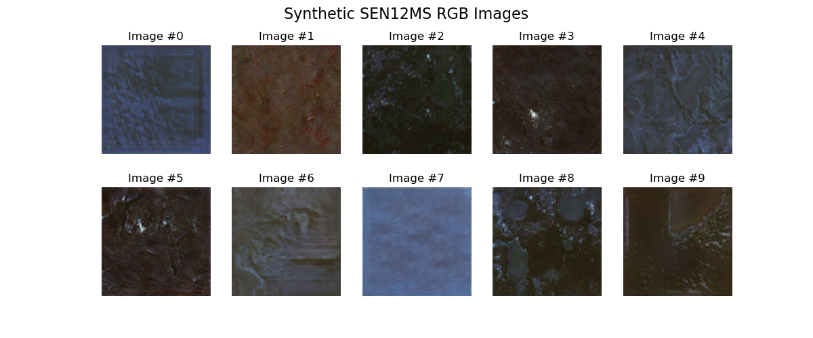

# CRT First Year Placement 2023 - Met Éireann

## Synthetic Generation of Satellite Imagery

The use of a ProGAN for synthetic satellite imagery is also described by Abady et. al (https://www.researchgate.net/publication/346821973_GAN_generation_of_synthetic_multispectral_satellite_images), and the initial aim of this work is to reproduce this GAN, in this case using PyTorch in favour of TensorFlow.

The progressive GAN architecture described here originally comes from this paper: **https://arxiv.org/pdf/1710.10196.pdf**, while the PyTorch implementation of a similar ProGAN archictecture comes from here: **https://www.kaggle.com/code/paddeaux/pggan-progressive-growing-gan-pggan-pytorch/edit**

A means of expanding on this original work is to bring seasonality into the network - allowing the generation of synthetic images representative of seasonality



## Datasets & Checkpoints
Datasets and model checkpoints should be located in the parent folder of `met`, as **"input"** and **"checkpoints"** respectively:

* The **SEN12MS** dataset is available here: **https://mediatum.ub.tum.de/1474000**
* Checkpoints for a full training run (~268 total epochs):
   * **Generator**: **https://maynoothuniversity-my.sharepoint.com/:u:/g/personal/patrick_gorry_2015_mumail_ie/EVGqZR6EXuZCvW1wRcGBYqgBRUXga3__uhlTnd9u0mdHzw?e=udqLaR&download=1**
   * **Critic**: **https://maynoothuniversity-my.sharepoint.com/:u:/g/personal/patrick_gorry_2015_mumail_ie/EUdYNl26n9FHiU59w8bkNt4BTrD8Fvmt0LF225YDJF3mLg?e=xLgOvs&download=1**


## Training/Loading a Model
* Training a new model or loading the last checkpoints is done using the `--mode/-m` flag:
   ```
   python progan.py --mode train
   ```
* Loading a pre-trained model and plotting a set of sample images, viewing just the visible RGB bands:
   ```
   python progan.py -m load --plot rgb
   ```
* Viewing all thirteen bands from a single generated satellite image can be done also:
   ```
   python progan.py -m load --plot full
   ```
 
 

